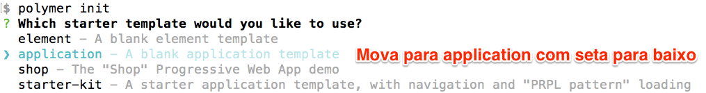

# progressive-web-app/work

Instale o **bower** e o **polymer-cli** usando `npm install -g` e depois faça: 

```bash
polymer init
```



```bash
? Which starter template would you like to use? application
info:    Running template application...
? Application name chrome-developer-channel
? Main element name show-app
? Brief description of the application Shows for web developers
   create bower.json
   create index.html
   . . . 
```

O esqueleto da aplicação é gerado. Veja o conteudo do diretório corrente.

```bash
ls -lat
```

> Entrypoint: When you generate a project using the Polymer CLI, the new project contains an entrypoint index.html, which imports and instantiates the app shell

O arquivo service-worker.js é gerado automaticamente.

```bash
touch service-worker.js
subl -a service-worker.js
subl -a index.html
```
Edite o index.html colocando o código abaixo no `<head>`

```javascript
<script>
  if ('serviceWorker' in navigator) {
    window.addEventListener('load', function() {
      navigator.serviceWorker.register('/service-worker.js');
    });
  }
</script>
```

> Chrome automatically installs Roboto in the user's computer.

Adicione um estilo

```css
<style>
  body {
    margin: 0;
    background-color: black;
    background-image: linear-gradient(to bottom, rgb(0, 0, 0) 0%, rgb(50, 50, 50) 50%, rgb(0, 0, 0) 100%);
    background-attachment: fixed;
    font-family: 'Roboto', 'Noto', sans-serif;
  }
</style>
```


```bash
polymer serve -p 3000 --open
```

To start working on the app shell you will need to install a few dependencies using bower:

```bash
bower install  --save PolymerElements/app-layout#^0.10.0 PolymerElements/app-route#^0.9.0 PolymerElements/iron-flex-layout#^1.0.0 PolymerElements/iron-pages#^1.0.0 PolymerElements/paper-icon-button#^1.0.0
```


Copying the seed element

Open src/show-app/show-app.html and paste the content from the seed element pwa-from-scratch-master/resouces/show-app.html or run:

cp ../resources/show-app.html src/show-app/show-app.html
The seed element contains the CSS, so we don't need to worry about writing all the CSS rules for the show-app element.


```javascript

```


```bash

```

```bash

```

```bash

```
